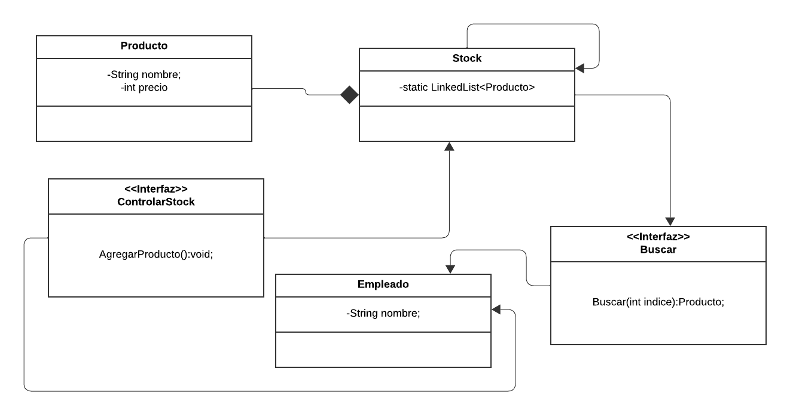

<h1> Ejemplo singleton, interfaces, excepcioens </h1>

<h2>Diagrama de clases</h2>

<a href="https://lucid.app/lucidchart/d5ed8d42-2a38-4116-9e87-94c33de62069/edit?view_items=m1L.0e60LZ.l&invitationId=inv_6b6a7452-f46f-4d6d-95b0-8fae7e8bd29a">Diagrama de clases</a>
